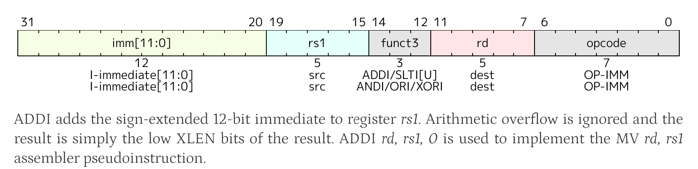

`addi` 指令的编码和功能描述如下：



### 编码

* **格式** ：I 型（I-type）
* **opcode** ：`0010011`
* **funct3** ：`000`
* **立即数字段** ：`imm[11:0]`（12 位，符号扩展至 XLEN 位）

 **指令编码图** （来自第 34 章 RV32/64G Instruction Set Listings 中的表格）：

**text**

```
imm[11:0]   rs1   000   rd   0010011
```

在 RV32I 基础指令集中，`addi` 被列为：

**text**

```
imm[11:0]   rs1   000   rd   0010011   ADDI
```

### 功能描述

> ADDI adds the sign-extended 12-bit immediate to register rs1. Arithmetic overflow is ignored and the result is simply the low XLEN bits of the result.
> — **Chapter 2.4.1, Page 26 (PDF 页码 26)**

即：`rd = rs1 + sext(immediate)`，溢出被忽略，结果取低 XLEN 位。

 **原文位置** ：

* 编码列表： **Chapter 34, Page 554 (PDF 页码 554)** ，RV32I Base Instruction Set 表格。
* 功能描述： **Chapter 2.4.1, Page 26 (PDF 页码 26)** 。
