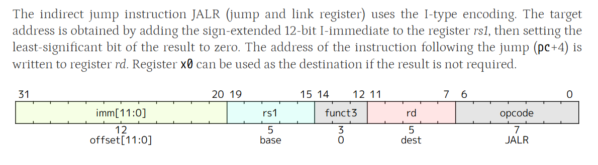

`jalr`（jump and link register）指令的编码和功能描述如下：



### 编码
- **格式**：I 型（I-type）
- **opcode**：`1100111`
- **funct3**：`000`

**指令编码图**（来自第 34 章 RV32/64G Instruction Set Listings 中的表格）：
```
imm[11:0]   rs1   000   rd   1100111   JALR
```

### 功能描述
> The indirect jump instruction JALR (jump and link register) uses the I- type encoding. The target address is obtained by adding the sign- extended 12- bit I- immediate to the register rs1, then setting the least- significant bit of the result to zero. The address of the instruction following the jump (pc+4) is written to register rd. Register x0 can be used as the destination if the result is not required.
> — **Chapter 2.5.1, Page 28 (PDF 页码 28)**

即：
- 目标地址 = `(rs1 + sext(immediate))` 并将最低位清零（保证指令地址对齐）。
- `rd = pc + 4`（返回地址）。
- 若 `rd = x0`，则不保存返回地址（相当于无条件间接跳转）。

**原文位置**：
- 编码列表：**Chapter 34, Page 554 (PDF 页码 554)**，RV32I Base Instruction Set 表格。
- 功能描述：**Chapter 2.5.1, Page 28 (PDF 页码 28)**。