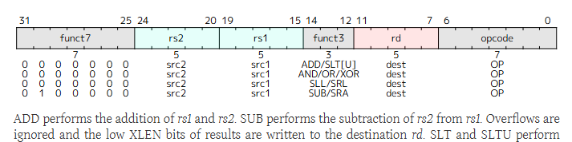

`add` 指令在 RV32I 中属于 R 型格式，其编码和功能如下：



### 编码
- **opcode**：`0110011`
- **funct3**：`000`
- **funct7**：`0000000`
- **寄存器字段**：`rs1`、`rs2`（源寄存器），`rd`（目的寄存器）

从第 34 章的指令列表中可查得：
```
0000000   rs2   rs1   000   rd   0110011   ADD
```

### 功能描述
> ADD performs the addition of rs1 and rs2. Overflows are ignored and the low XLEN bits of results are written to the destination rd.  
> — **Chapter 2.4.2, Page 27**

即：
```
rd = rs1 + rs2
```
算术溢出被忽略，仅保留低 XLEN 位（在 RV32I 中为低 32 位）。

---

### 在 `minirv` 中的实现
在 Logisim 中实现 `add` 时，你需要：
1. 从指令中解码出 `rs1`、`rs2` 和 `rd` 字段。
2. 从寄存器堆（16 个 32 位寄存器）中读取 `rs1` 和 `rs2` 的值。
3. 将这两个值送入 ALU，ALU 配置为加法模式。
4. 将 ALU 的结果写回寄存器堆的 `rd` 位置（同时更新 PC 为 PC+4）。

由于 `add` 不涉及内存访问，控制信号需确保不触发数据存储器的写使能，且 `jalr` 等跳转指令的逻辑不被激活。