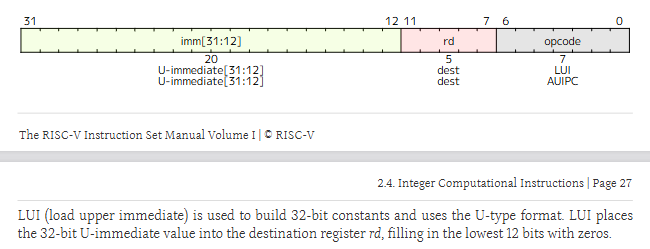

`lui`（load upper immediate）指令在 RV32I 中属于 U 型格式，其编码和功能如下：



### 编码

- **opcode**：`0110111`
- **立即数字段**：`imm[31:12]`（20 位）
- **寄存器字段**：`rd`（目的寄存器）

从第 34 章的指令列表中可查得：

```text
imm[31:12]   rd   0110111   LUI
```

### 功能描述
>
> LUI (load upper immediate) is used to build 32- bit constants and uses the U- type format. LUI places the 32- bit U- immediate value into the destination register rd, filling in the lowest 12 bits with zeros.  
> — **Chapter 2.4.1, Page 27**

即：

```text
rd = imm[31:12] << 12
```

低 12 位填 0，形成 32 位立即数。

对于 RV32I，该结果直接就是 32 位无符号整数；若在 RV64I 中，还需符号扩展到 64 位，但 `minirv` 基于 RV32I，因此无需扩展。

### 在 `minirv` 中的实现

- 从指令中提取 20 位立即数 `imm[31:12]`。
- 将 `imm` 左移 12 位（即 `imm << 12`），低 12 位自动补 0。
- 将结果写入寄存器堆的 `rd` 位置。
- PC 更新为 PC+4。

`lui` 常与 `addi` 配合构造 32 位常数，例如 `lui rd, imm20` + `addi rd, rd, imm12`。
