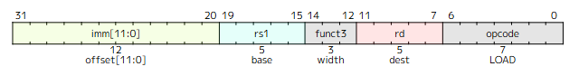
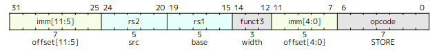

以下分别是 `lw`、`lbu`、`sw`、`sb` 四条指令在 RV32I 中的编码和功能描述（均来自第 2.6 节及第 34 章指令表）：

---

### 1. `lw` (Load Word)



**编码**  

- 格式：I 型（I‑type）  
- opcode：`0000011`  
- funct3：`010`  

指令表（第 34 章）中列为：

```text
imm[11:0]   rs1   010   rd   0000011   LW
```

**功能描述**  
> The LW instruction loads a 32‑bit value from memory into rd.  
> — **Chapter 2.6, Page 32**

即：`rd = mem[rs1 + sign_extend(imm)]`（符号扩展仅针对地址计算，数据直接以 32 位写入 rd）。

---

### 2. `lbu` (Load Byte Unsigned)


**编码**  

- 格式：I 型  
- opcode：`0000011`  
- funct3：`100`  

指令表（第 34 章）中列为：

```text
imm[11:0]   rs1   100   rd   0000011   LBU
```

**功能描述**  
> LBU loads a 16‑bit value from memory but then zero extends to 32‑bits before storing in rd.  
> — **Chapter 2.6, Page 32** （原文中描述的是 LHU，但 LB/LBU 的定义类似：LB 是 sign‑extend，LBU 是 zero‑extend。第 2.6 节对 LBU 的说明是：LB and LBU are defined analogously for 8‑bit values. LBU zero‑extends to 32‑bits.)

更准确地说：
> LB and LBU are defined analogously for 8‑bit values.  
> — **Chapter 2.6, Page 32**

即：`rd = zero_extend(mem[rs1 + sign_extend(imm)][7:0])`。

---

### 3. `sw` (Store Word)



**编码**  

- 格式：S 型（S‑type）  
- opcode：`0100011`  
- funct3：`010`  

指令表（第 34 章）中列为：

```text
imm[11:5]   rs2   rs1   010   imm[4:0]   0100011   SW
```

**功能描述**  
> The SW ... instructions store 32‑bit ... values from the low bits of register rs2 to memory.  
> — **Chapter 2.6, Page 32**

即：`mem[rs1 + sign_extend(imm)] = rs2[31:0]`。

---

### 4. `sb` (Store Byte)


**编码**  

- 格式：S 型  
- opcode：`0100011`  
- funct3：`000`  

指令表（第 34 章）中列为：

```text
imm[11:5]   rs2   rs1   000   imm[4:0]   0100011   SB
```

**功能描述**  
> The SB ... instructions store 8‑bit values from the low bits of register rs2 to memory.  
> — **Chapter 2.6, Page 32**

即：`mem[rs1 + sign_extend(imm)] = rs2[7:0]`。

---

### 原文位置汇总

- 指令编码表：**Chapter 34, Page 554 (PDF 页码 554)**，RV32I Base Instruction Set 表格。
- 功能描述：**Chapter 2.6, Page 31–32 (PDF 页码 31–32)**。
